# 🤖 AI Research & Productivity Agent

A comprehensive AI-powered productivity assistant that combines web research, note-taking, and task management using modern AI technologies.

## 🌟 Features

- **🌐 Web Research**: Fetch and summarize content from any URL
- **📝 Smart Notes**: Create, organize, and search notes with tags
- **✅ Task Management**: Add, complete, and track tasks with priorities
- **🔄 Real-time Dashboard**: Live workspace statistics and activity monitoring
- **🎯 AI-Powered**: Uses LangGraph ReAct agent for intelligent tool selection
- **⚡ Fast**: Built with FastMCP for optimal performance

## 🏗️ Architecture



### Architecture Flow

```
User Input
    |
    v
Streamlit UI (Chat Interface)
    |
    v
LangGraph Agent (ReAct Reasoning)
    |
    v
MCP Client (MultiServerMCPClient)
    |
    v
FastMCP Server (Notes + Tasks + Web Fetch)
    |
    v
JSON Storage (notes.json + tasks.json)
│         (Tool Selection + Reasoning)           │
└─────────────────┬───────────────────────────┘
                  │
                  ▼
┌─────────────────────────────────────────────────────────┐
│          FastMCP Server                       │
│    (Notes + Tasks + Web Fetch Tools)        │
```

### Component Details

- **Streamlit UI**: Modern web interface with chat and dashboard
- **LangGraph Agent**: ReAct agent for intelligent tool selection and reasoning
- **Groq LLM**: High-performance inference (llama-3.3-70b-versatile)
- **MCP Client**: Manages communication with MCP servers
- **FastMCP Server**: Provides productivity tools (notes, tasks, web fetch)
- **JSON Storage**: Persistent data storage for notes and tasks

## 🛠️ Technology Stack

- **FastMCP**: Custom MCP server for tool integration
- **LangGraph**: ReAct agent for multi-step reasoning
- **Groq**: High-performance LLM (llama-3.3-70b-versatile)
- **Streamlit**: Modern web UI with real-time updates
- **Python 3.11**: Core implementation language

## 🚀 Quick Start

### Prerequisites

- Python 3.11 or higher
- Git for cloning
- Groq API key (free tier available)

### Installation

1. **Clone the repository**
   ```bash
   git clone <repository-url>
   cd ai-productivity-agent
   ```

2. **Create virtual environment**
   ```bash
   python -m venv venv
   source venv/bin/activate  # On Windows: venv\Scripts\activate
   ```

3. **Install dependencies**
   ```bash
   pip install -r requirements.txt
   ```

4. **Configure environment**
   ```bash
   cp .env.example .env
   # Edit .env with your Groq API key
   ```

5. **Start the application**
   ```bash
   streamlit run ui/app.py
   ```

The application will open in your browser at `http://localhost:8501`

## 🔧 Configuration

### Environment Variables

Create a `.env` file in the project root:

```env
# Required: Get from https://console.groq.com/keys
GROQ_API_KEY=your_groq_api_key_here

# Optional: Model configuration
GROQ_MODEL=llama-3.3-70b-versatile
LLM_TEMPERATURE=0
LLM_MAX_TOKENS=800

# Optional: Agent behavior
AGENT_RECURSION_LIMIT=25
AGENT_MAX_ITERATIONS=10
```

## 📋 Available Tools

### Core Productivity Tools

| Tool | Description | Parameters |
|-------|-------------|------------|
| `add_note` | Create a new note | `title`, `content`, `tags` (optional) |
| `list_notes` | Show all notes | None |
| `search_notes` | Search notes by keyword | `query` |
| `add_task` | Create a new task | `task`, `priority` (low/medium/high), `due_date` (optional) |
| `complete_task` | Mark task as complete | `task_id` |
| `list_tasks` | Show all tasks | None |
| `get_summary` | Get workspace statistics | None |

### Research Tools

| Tool | Description | Parameters |
|-------|-------------|------------|
| `fetch_url` | Fetch content from web URL | `url` |

### Bonus Features

| Resource/Prompt | Description |
|-----------------|-------------|
| `workspace://overview` | Complete workspace data |
| `workspace://notes` | All notes for context |
| `workspace://tasks` | All tasks for context |
| `weekly_review` | Comprehensive weekly review template |
| `research_workflow` | Structured research process |
| `task_management` | Task management best practices |

## 💡 Example Queries

### Research Workflow
```bash
# Research and save key points
"Research FastMCP and save key points"

# Research specific topic
"Summarize https://en.wikipedia.org/wiki/LangChain and save as a note"
```

### Task Management
```bash
# Add tasks with priorities
"Add task: complete project report by tomorrow, high priority"
"Add task: review documentation, medium priority, due Friday"

# View and complete tasks
"Show all my tasks"
"Complete task: [task-id]"
```

### Note Management
```bash
# Create notes
"Add note: meeting notes from today's standup"
"Add note: key insights from FastMCP research"

# Search and view notes
"Search notes for 'FastMCP'"
"Show all my notes"
```

### Workspace Overview
```bash
# Get statistics
"Give me a workspace summary"
"What tasks are pending?"
"How many notes do I have?"
```

## 🎯 Usage Examples

### Complete Research Workflow
1. **User**: "Research FastMCP and save key points"
2. **Agent**: 
   - Fetches content from FastMCP documentation
   - Analyzes and summarizes key features
   - Creates structured note with tags
   - Confirms successful save

### Task Management
1. **User**: "Add task: complete assignment by Friday, high priority"
2. **Agent**:
   - Creates task with specified priority and due date
   - Returns task ID for tracking
   - Updates dashboard statistics

### Daily Review
1. **User**: "Give me a workspace summary"
2. **Agent**:
   - Retrieves all notes and tasks
   - Calculates completion statistics
   - Provides productivity insights

## 📊 Dashboard Features

The Streamlit UI provides:

- **Real-time Statistics**: Notes count, task completion rates
- **Chat Interface**: Natural language interaction with agent
- **Tool Activity Log**: Transparent view of all operations
- **Quick Actions**: One-click access to common operations
- **Progress Tracking**: Visual progress bars and completion metrics

## 🔍 Troubleshooting

### Common Issues

**Issue**: "ModuleNotFoundError: No module named 'langgraph'"
```bash
# Solution: Install missing dependencies
pip install langgraph langchain langchain-groq
```

**Issue**: "Rate limit reached" (Groq API)
```bash
# Solution: Wait for reset or upgrade plan
# Free tier: 100,000 tokens/day
# Check .env for correct API key
```

**Issue**: "MCP server not found"
```bash
# Solution: Check Python path and installation
export PYTHONPATH="${PYTHONPATH}:$(pwd)"
python -m mcp_server.server
```

### Debug Mode

Enable detailed logging:
```python
# In agent/config.py
import logging
logging.basicConfig(level=logging.DEBUG)
```

## 🧪 Testing

Run the comprehensive test suite:
```bash
# Test all components
python full_test.py

# Test dashboard functionality
python test_dashboard.py

# Test individual components
python -m pytest tests/
```

## 📁 Project Structure

```
ai-productivity-agent/
├── agent/                  # LangGraph agent implementation
│   ├── agent.py           # Agent entry point
│   ├── config.py          # Configuration and system prompt
│   └── graph.py           # ReAct agent graph
├── mcp_server/            # FastMCP server
│   ├── server.py          # Main server with tools
│   ├── storage.py         # JSON storage manager
│   ├── utils.py           # Helper functions
│   └── data/              # JSON data files
├── ui/                    # Streamlit interface
│   └── app.py            # Main UI application
├── tests/                  # Test suite
├── requirements.txt         # Python dependencies
├── .env.example           # Environment template
└── README.md              # This file
```

## 🎨 Customization

### Adding New Tools

1. **Create tool function** in `mcp_server/server.py`:
   ```python
   @mcp.tool()
   def your_tool(param: str) -> Dict[str, Any]:
       """Tool description."""
       try:
           # Your logic here
           return success({"result": data})
       except Exception as e:
           return failure(str(e))
   ```

2. **Update system prompt** in `agent/config.py`:
   ```python
   SYSTEM_PROMPT = """...
   - your_tool(param): Tool description
   ..."""
   ```

### Modifying UI

Edit `ui/app.py` to:
- Add new sidebar components
- Customize response formatting
- Add new quick actions
- Modify dashboard metrics

## 🔒 Security

- **API Keys**: Stored in `.env` file, never in code
- **Input Validation**: All user inputs validated server-side
- **Error Handling**: No sensitive data leaked in errors
- **HTTPS**: Web fetches use secure connections when possible

## 🚀 Performance

- **Token Optimization**: Content truncated to prevent API limits
- **Caching**: MCP client and graph cached for speed
- **Async Operations**: Non-blocking UI and agent operations
- **Error Recovery**: Graceful fallbacks for API failures

## 🤝 Contributing

1. Fork the repository
2. Create feature branch: `git checkout -b feature-name`
3. Make changes and test thoroughly
4. Commit changes: `git commit -m "Add feature"`
5. Push to branch: `git push origin feature-name`
6. Open pull request

## 📄 License

This project is licensed under the MIT License - see LICENSE file for details.

## 🙏 Acknowledgments

- **FastMCP**: High-performance MCP framework
- **LangGraph**: Advanced agent orchestration
- **Groq**: Fast, reliable LLM API
- **Streamlit**: Beautiful UI framework

## 📞 Support

For issues and questions:
- Check troubleshooting section above
- Review test files for usage examples
- Examine logs for error details
- Verify environment configuration

---

**Built with ❤️ using cutting-edge AI technologies**
